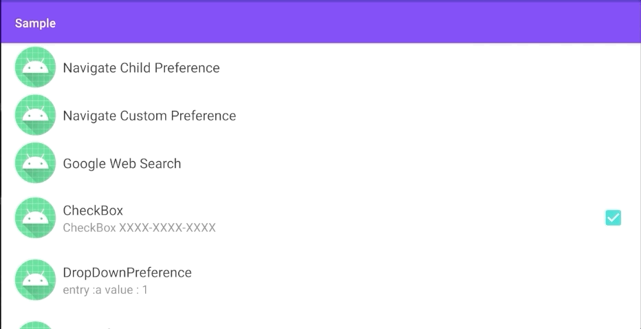
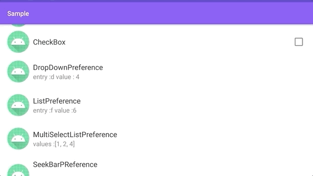
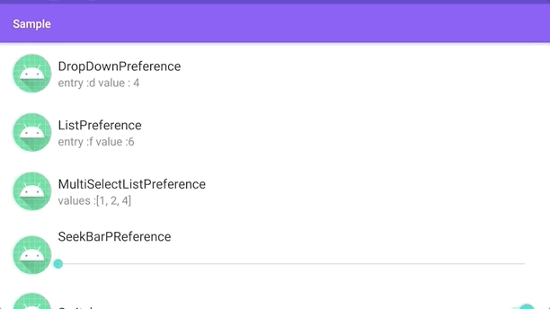
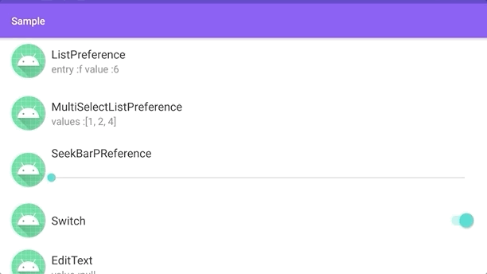
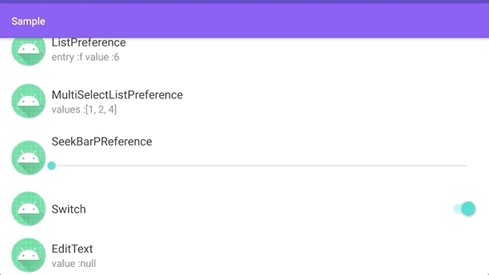
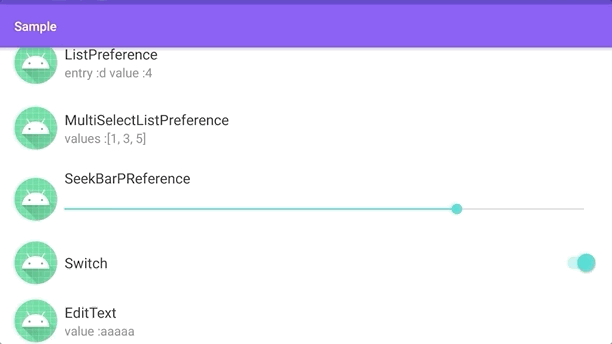
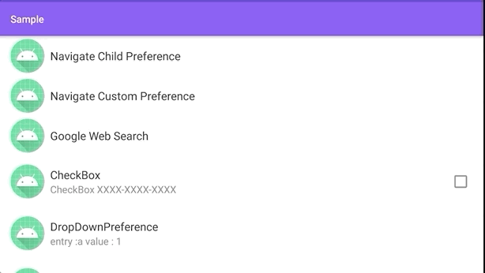

# 2020/08/08［Android］AndroidX Preference Library で作れる設定画面まとめ

# はじめに

AndroidX Preference Library でどのような設定画面が実装できるのかまとめが欲しかったので作成しました。基本的な使い方は[こちら](https://qiita.com/kaleidot725/items/f9ce2fbbf479d2a9f2bb)にまとめていますので参考にしてみてください。

| 要素                      | 説明                                                 | 見た目                                                       |
| ------------------------- | ---------------------------------------------------- | ------------------------------------------------------------ |
| Preference                | Fragmentへの遷移や Intent を発行するときに利用する。 |        |
| CheckBoxPreference        | チェックボックスで値を設定する。                     |  |
| DropDownPreference        | ドロップダウンリストから選択する。                   |                   |
| ListPreference           | 指定したリストをダイアログで選択する                 |               |
| MultiSelectListPreference | 設定したリストをダイアログで複数選択する。           |                  |
| SeekBarPreference         | シークバーにて値を指定する                           |                    |
| SwitchPreferenceCompat    | スイッチで値を設定する。                             |                 |
| EditTextPreference        | 文字入力ダイアログにて文字列を設定する。             |                  |
# Preference

Preference は設定画面にて他の Fragment への遷移、 Intent の発行する時に使える。

### Fragment に遷移する

Preference をクリックしたときに他の Fragment に遷移することができます。
遷移するにはまず`app:Fragment`に Fragment を指定する必要があります。

```xml
    <Preference
        app:fragment="jp.kaleidot725.sample.setting.ChildPreferenceFragment"
        app:icon="@mipmap/ic_launcher_round"
        app:key="childPreferenceFragment"
        app:title="Navigate Child Preference" />
```

`app:fragment` を指定すると`PreferenceFragmentCompat.OnPreferenceStartFragmentCallback` を通して指定した Fragment のクラス情報が渡されるようになります。なので渡された情報から Fragment を生成して遷移してやります。

```kotlin
class MainActivity : AppCompatActivity(R.layout.activity_main), PreferenceFragmentCompat.OnPreferenceStartFragmentCallback{
    override fun onPreferenceStartFragment(caller: PreferenceFragmentCompat, pref: Preference): Boolean {
        val fragment = supportFragmentManager.fragmentFactory.instantiate(classLoader, pref.fragment).apply {
            arguments = pref.extras
            setTargetFragment(caller, 0)
        }
        supportFragmentManager.beginTransaction().replace(R.id.fragment_container, fragment).addToBackStack(null).commit()
        return true
    }
}
```

そうすると次のように Fragment に遷移できるようになります。遷移する Fragment は特に制約などありませんので Preference を使った Fragment を実装して遷移すれば設定画面の階層を定義できます。


### Intent を発行する

Preference をクリックしたときに Intent を発行することもできます。
次のように Intent を指定すれば、特定の Web ページを開くことができます。

```xml
    <Preference
        app:icon="@mipmap/ic_launcher_round"
        app:key="intent"
        app:title="Google Web Search">
        <intent
            android:action="android.intent.action.VIEW"
            android:data="http://www.google.com" />

    </Preference>
```



## CheckBoxPreference

CheckBoxPreference を使えば CheckBox を表示できます。
CheckBox なので true と false の ブール値を設定できます。

```xml
    <CheckBoxPreference
        app:icon="@mipmap/ic_launcher"
        app:key="checkBoxPreference"
        app:title="CheckBox" />
```


## SwitchPreferenceCompat

CheckBoxPreference を使えば Switch を表示できます。
Switch なので true と false の ブール値を設定できます。

```xml
    <SwitchPreferenceCompat
        app:icon="@mipmap/ic_launcher_round"
        app:key="switchPreference"
        app:summary="Enable XXXX-XXXX-XXXX"
        app:title="Switch" />
```


## DropDownPreference

DropDownPrefrence を使えば、次のようなリストのダイアログを表示できます。
リストに表示する項目の名称は `entries` 項目の値は `entryValues` にセットします。

```xml
    <DropDownPreference
        app:entries="@array/entries"
        app:entryValues="@array/entryValues"
        app:icon="@mipmap/ic_launcher"
        app:key="dropDownPreference"
        app:title="DropDownPreference"
        app:useSimpleSummaryProvider="true" />
```

`entries` や `entryValues` にセットする値は `values/array.xml` にあらかじめ定義しておく必要があります。

```xml
<?xml version="1.0" encoding="utf-8"?>
<resources>
    <string-array name="entries">
        <item>a</item>
        <item>b</item>
        <item>c</item>
        <item>d</item>
        <item>e</item>
        <item>f</item>
        <item>g</item>
        <item>h</item>
    </string-array>

    <string-array name="entryValues">
        <item>1</item>
        <item>2</item>
        <item>3</item>
        <item>4</item>
        <item>5</item>
        <item>6</item>
        <item>7</item>
        <item>8</item>
    </string-array>
</resources>
```


## ListPreference

ListPreference を使えば、次のようなリストのダイアログを表示できます。
リストに表示する項目の名称は `entries` 項目の値は `entryValues` にセットします。

```xml
    <ListPreference
        app:entries="@array/entries"
        app:entryValues="@array/entryValues"
        app:icon="@mipmap/ic_launcher"
        app:key="listPreference"
        app:title="ListPreference"
        app:useSimpleSummaryProvider="true" />
```

`entries` や `entryValues` にセットする値は `values/array.xml` にあらかじめ定義しておく必要があります。

```xml
<?xml version="1.0" encoding="utf-8"?>
<resources>
    <string-array name="entries">
        <item>a</item>
        <item>b</item>
        <item>c</item>
        <item>d</item>
        <item>e</item>
        <item>f</item>
        <item>g</item>
        <item>h</item>
    </string-array>

    <string-array name="entryValues">
        <item>1</item>
        <item>2</item>
        <item>3</item>
        <item>4</item>
        <item>5</item>
        <item>6</item>
        <item>7</item>
        <item>8</item>
    </string-array>
</resources>
```


## MultiSelectListPreference

MultiSelectListPreference を使えば、次のような複数選択できるリストのダイアログを表示できます。
リストに表示する項目の名称は `entries` 項目の値は `entryValues` にセットします。

```xml
    <MultiSelectListPreference
        app:entries="@array/entries"
        app:entryValues="@array/entryValues"
        app:icon="@mipmap/ic_launcher"
        app:key="multiSelectListPreference"
        app:title="MultiSelectListPreference" />
```

`entries` や `entryValues` にセットする値は `values/array.xml` にあらかじめ定義しておく必要があります。

```xml
<?xml version="1.0" encoding="utf-8"?>
<resources>
    <string-array name="entries">
        <item>a</item>
        <item>b</item>
        <item>c</item>
        <item>d</item>
        <item>e</item>
        <item>f</item>
        <item>g</item>
        <item>h</item>
    </string-array>

    <string-array name="entryValues">
        <item>1</item>
        <item>2</item>
        <item>3</item>
        <item>4</item>
        <item>5</item>
        <item>6</item>
        <item>7</item>
        <item>8</item>
    </string-array>
</resources>
```


## SeekBarPreference

SeekBarPrefrence を使えば次のような SeekBar を表示できます。
SeekBar の最大値は `android:max` 最小値は `app:min` でセットします。

```xml
    <SeekBarPreference
        app:icon="@mipmap/ic_launcher"
        app:key="seekBarPreference"
        android:max="99"
        app:min="1"
        app:title="SeekBarPReference" />
```


## EditTextPreference

EditTextPreference を使えば次のような文字を入力するダイアログを表示できます。

```xml
    <EditTextPreference
        app:icon="@mipmap/ic_launcher"
        app:key="editTextPreference"
        app:title="EditText"
        app:useSimpleSummaryProvider="true" />
```

# おわりに

というように基本的な設定画面を作るためのものは用意されていて、もし独自の設定画面が必要であれば Fragment を実装できるような仕組みになっています。
なので AndroidX Preference Library を使えば設定画面の作成で困ることはなさそうです。
